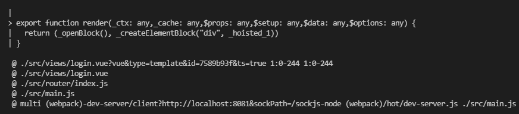
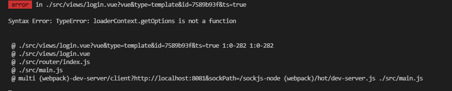
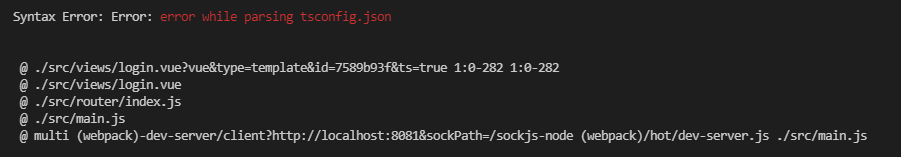
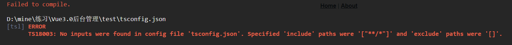
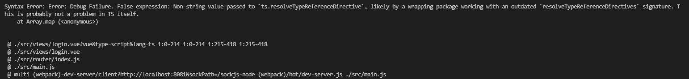

# Vue3.0新建项目大坑（脚手架）

## 1.vue文件刚一写东西就报错



原因：不支持ts语法

解决办法：

1.`<script lang="ts">`    删除lang="ts"，但这样就不能使用ts语法了

2.另外引入typescript，`ts-loader`是用于 `webpack` 的 `TypeScript` 加载器，将 `TypeScript` 编译成 `JavaScript`。

`ts-loader` 在内部是调用了 `TypeScript` 的官方编译器 – `tsc`。所以，`ts-loader` 和 `tsc` 是共享 `tsconfig.json`。

```
yarn add typescript ts-loader
```

3.配置webpack

```js
//根目录下新建vue.config.js
module.exports = {
    configureWebpack: {
        resolve: { extensions: [".ts", ".tsx", ".js", ".json"] },
        module: {
            rules: [
                { test: /\.ts$/, loader: "ts-loader" },
            ]
        }
    }
}
```

## 2.版本问题，报错如下



网上查资料是说`loaderContext.getOptions is not a function`是因为版本兼容问题，所以只能降低ts-loader的版本到5

## 3.缺少tsconfig.json



执行`tsc -init`初始化tsconfig.json，重新启动还是报错



需要在tsconfig.json中配置，需要在include对应的目录下随便新建一个ts文件即可编译通过

```json
 // 与compilerOptions配置同级
 "include": [
    "src/**/*"
  ],
  "exclude": [
    "node_modules"
  ]
```

## 4.typescript版本太高问题



只能将typescript版本降到4.5.4

最终版本如下

```json
"dependencies": {
    "core-js": "^3.6.5",
    "ts-loader": "5",
    "typescript": "4.5.4",
    "vue": "^3.0.0",
    "vue-router": "^4.0.0-0",
    "vuex": "^4.0.0-0"
  },
```

