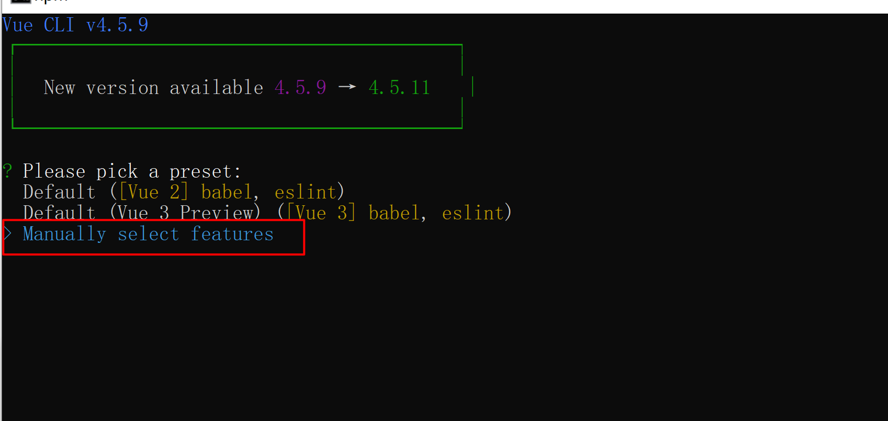
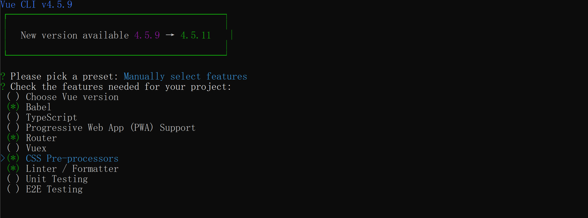
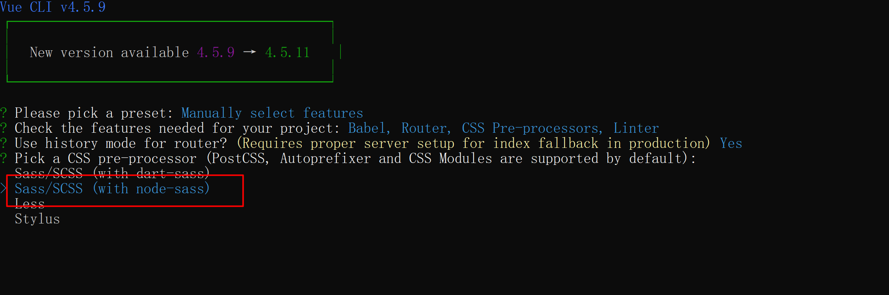
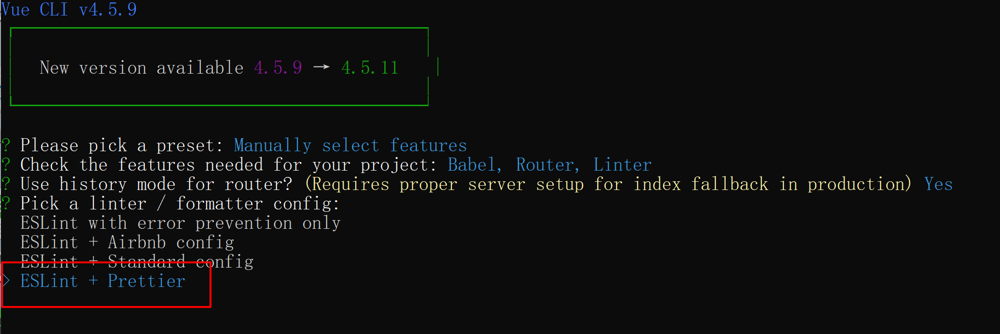
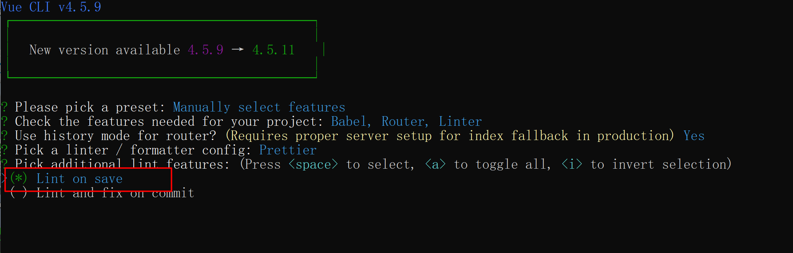
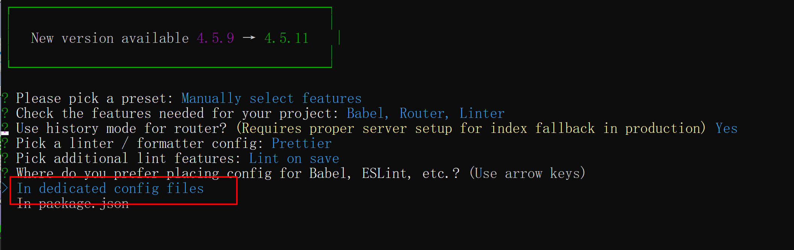
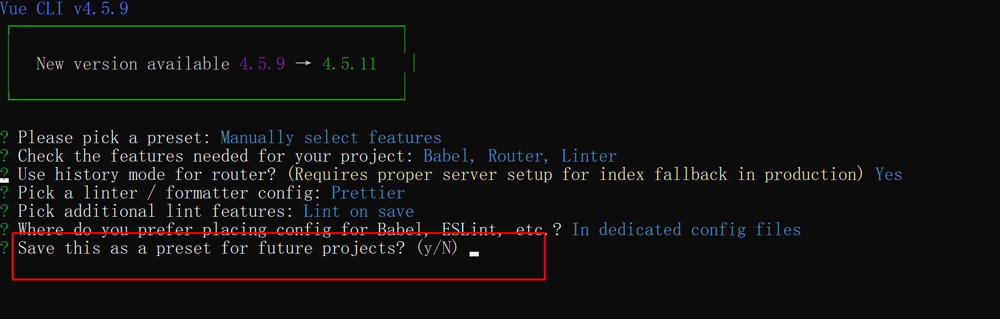
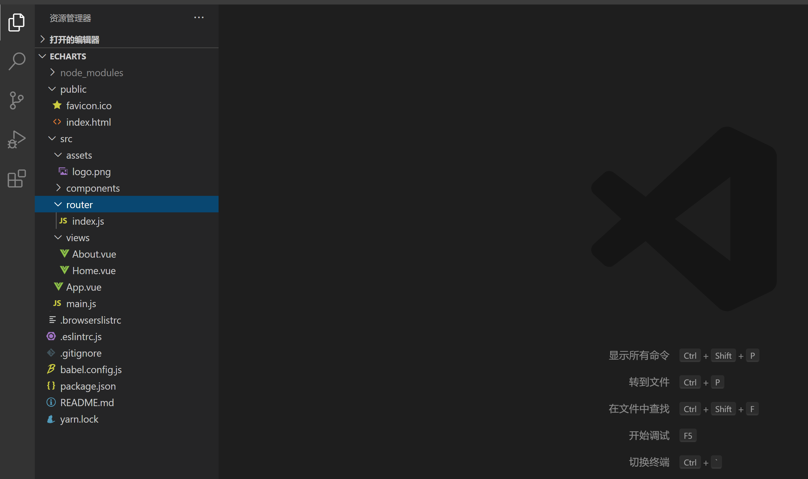

创建Vue3.0项目

到指定文件目录下，打开cmd控制台，输入

```
vue create aoyafont-padnew  //aoyafont-padnew为项目名
```

依次选择：

手动选择配置



一般会选择以下几项，需要vuex可选择vuex，CSS那项是预处理器，



安装node-sass



代码规范，一般选择这一项，实际开发中会使用prettier



选择保存就检测代码



选择独立存放配置文件



要记录本次的配置吗，记录的话要起一个名字



新建后的文件目录

